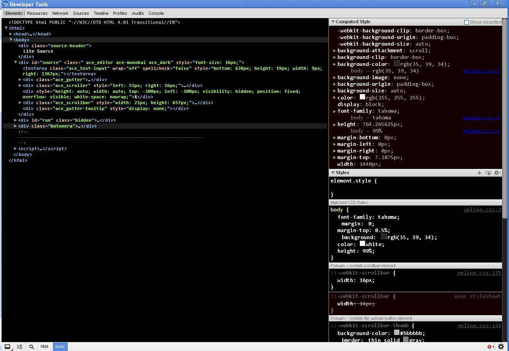

pitch-black
===========

Custom.css for Chrome (and Chromium) Developer Tools

To install on Chrome:
---------------------

Download Custom.css to....

Linux:  
<pre>
~/.config/chrome/Default/User StyleSheets/
</pre>

Mac:   
<pre>
~/Library/Application Support/Google/Chrome/Default/User StyleSheets/
</pre>

Windows XP:   
<pre>
C:\Documents and Settings\**Your username**\Local\Application Data\Google\Chrome\User Data\Default\User StyleSheets
C:\Documents and Settings\**Your username**\Configuración local\Datos de programa\Google\Chrome\User Data\Default\User StyleSheets
</pre>

Windows 7:   
<pre>
C:\Users\**Your username**\AppData\Local\Google\Chrome\User Data\Default\User StyleSheets\
</pre>

Windows, Chromium Portable:  
<pre>
C:\ChromiumPortable\Data\Profiles\Default\User StyleSheets
</pre>

